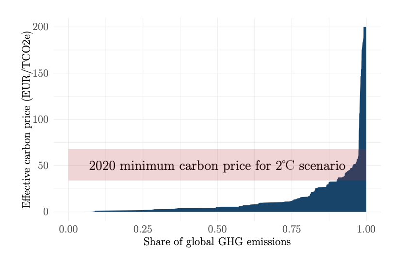

# Credit_Risk_Sensitivity_to_Carbon_Price

## Motivations

Climate change impacts the functioning of human societies and global economic activity. To prevent its
unfavorable consequences, the international community has committed to reduce its global greenhouse
gas (GHG) emissions to keep global average warming below 2 degree, along with a more ambitious
objective of 1.5 degree. This recent commitment made rise up the number of carbon price impact
studies as in (Bouchet & al., [2020](https://papers.ssrn.com/sol3/papers.cfm?abstract_id=3574486)). The authors Vincent Bouchet and Theo le Guenedal have
made a study on the impact of price carbon shifts on the credit risk of 795 international companies,
they employed a Merton based model.  

### Previous studies

Bottom-up analysis on stranded assets (Caldecott & al., [2017](https://papers.ssrn.com/sol3/papers.cfm?abstract_id=2724550)), this study talk about the impact
of carbon price variation on the way the assets of a company can become stranded because of the
transition. Studies on stranded assets are relevant for specific sectors but require asset level data and
can hardly be generalized at a portfolio level.  
Bottom-up transmission of carbon price shocks Among the transition risk transmission channels, the
impact of the carbon price has the advantage of being a comparable factor across sectors. Howard and
(Patrascu & al., [2017](https://www.cazenovecapital.com/sysglobalassets/digital/insights/2018/sustainability/2017-09-climate-change---redefining-the-risks-carbon-var.pdf)) study the impact of a rise in the global carbon price up to USD 100 per tCO2
emitted. Companies’ costs will increase in proportion to the total emissions generated by themselves
and suppliers. The assumption is that companies will increase their prices to offset cost increases, so
returns on capital remain stable. Then, demand should fall in proportion to the price elasticity of each
market. A limitation of this study is that they apply one global carbon price (USD 100) and that this
price is the same for all regions.

## Approach of (Bouchet & al., [2020](https://papers.ssrn.com/sol3/papers.cfm?abstract_id=3574486))

Before getting interested into the methodology used in the study, clear definition of carbon cost has
to be settled down.  
What aim is pursued by using a carbon price ?  
Carbon price has been created to control and reduce the effects of global warming. Recent politics
decisions have been implemented to link companies carbon emissions to a cost in order to prompt their
management to reduce drastically these emissions.  
It is important to notice that there is a difference between the Social Cost of Carbon and the Effective
Cost. The SCC can be defined as the amount of GHG that should be taxed in order to maximize
welfare and the effective cost is related to local regulations.

*Evolution of the effective carbon price with respect to CO2 emissions*

The authors have studied carbon price impact among long-term and medium-term. To get the
most effective carbon price according to these horizon they took the SCC to compute the medium-
term study and the effective price related to local policies for the long-term study.  
The EBITDA is a key notion in the developments of the study. EBITDA is an acronym that stands
for ”earnings before interest, tax, depreciation, and amortization”. It measures the results of interest,
taxes and depreciation on fixed assets and immaterial assets. As an economic key figure, EBITDA
therefore solely represents the result of the company activities, with interest costs and interest earned
as well as all depreciation being excluded.  
The explicit formula is : EBITDA = Net Income + Taxes + Interest Expense + Depreciation/Amortization.

### The methodology and the model

As it has been seen previously, a change in carbon price can have an impact on firms. In the considered
paper a methodology has been developed to explain one of these impacts. Indeed, the authors are
interested in the impact of the carbon price on the probabilities of default of the firms.The crucial
assumptions and concepts used for defining the model are know introduced:

- $Scope_{1}(i,j,t)$ are the emissions in tons of $CO_{2}$ or equivalent emitted by the $i^{th}$ company, in the
region $j$ at time $t$.  
  
- We assume that a company can have an economic activity in several regions, and then emit $CO_{2}$
with different costs. Hence company’s total carbon cost $CC$ is:  
  
$$  
CC(i,k,t) = \sum_{j \in \mathcal{M}}Scope_{1}(i,j,t)CP(j,k,t)
$$  
  
where k is the considered scenario.  
  
- The shock to EBITDA for a particular scenario k is now defined, this is the ratio of $CC$ with
respect to the EBITDA.  
  
$$  
\xi(i,k,t) = \frac{CC(i,k,t)}{EBITDA(i,k=0,t=0)}
$$  
    
Intuitively, this ratio measures the impact of the $CC$ on the firm activity and allows to define a
metric in order to compare different firms, producing in different regions.  
  
- This paper focuses on comparability of different companies. The impact of the variation of
EBITDA on total asset value $V$ is computed using an approach that relies on the assumption
that the financial ratio between the enterprise value and the EBITDA remains constant over
time.  
  
$$  
V (i, t) = R_{i} × EBITDA(i, t)
$$  
    
where $R_{i}$ is a constant financial neutral ratio. The assumption is that $R_{i}$ is stable over time for
each company. This assumption seems restrictive but is verified by the study.  
  
- In order to integrate the shock to EBITDA in the firms valuation we define it as the ”carbon-
neutral”:  
  
$$  
V(i,k,t) =  (1-\xi(i,k,t))V(i,k=0,t=0)
$$  
    
This modelization allows to overcome the geographical issue presented before in (Patrascu & al., [2017](https://www.cazenovecapital.com/sysglobalassets/digital/insights/2018/sustainability/2017-09-climate-change---redefining-the-risks-carbon-var.pdf)). Each regions considered has its own specificities and mechanisms. In our model we add restrictive hypothesis to present a general model that can be calibrated to each region. Indeed, each region presents a carbon price denoted _CP_ for each time $t$ and for each scenarios $k$.
  
As we saw in the introduction, the main goal of the paper is to predict the probabilities of default
of a company, in different scenarios.  
In a first instance let us define the diffusion of asset’s value in Merton model:  
  
$$  
\frac{dV_{t}}{V_{t}} = rdt + \sigma dW_{t}
$$  
    
where \{ $W_{t}$ , $t \geq 0$ \} is a standard Brownian motion under the risk neutral probability, and r the risk free-rate.  
  
In Merton's model, under the risk-neutral probability, the equity value at time $t$ is equal to the expected discounted cash flows of the shareholders. Hence, the value of the equity is equal to the price of call on the firm assets of maturity T and strike D. We get the following formula:  
    
$$  
E(i) = V(i)\phi(d_{1})-D(i)\exp(-rT)\phi(d_{2})
$$  
    
using Black-Scholes formula, where $\phi$ is the cumulative normal distribution function and :  
  
$$  
d_{1} = \frac{\ln({\frac{V(i)}{D(i)}})+(r+\frac{\sigma_{V}(i)^{2}}{2})T)}{\sigma_{V}(i)\sqrt(T)}
$$  
  
$$  
d_{2} = d_{1} - \sigma_{V}(i)\sqrt{T}  
$$  
  
The initial total asset value $V (i, k = 0, t = 0)$ of the company $i$ and total asset volatility $\sigma(i)$, which are not observable, are determined by resolving the following system.  
      
$$  
E(i) = V(i)\phi(d_{1})-D(i)\exp(-rT)phi(d_{2})  \\
E(i) = \frac{\sigma_{V}(i)}{\sigma_{V}(i)}\phi(d_{1})V(i)
$$  
    

In this paper, the system is resolved in order to determine initial values for $V$ ($i$, $k = 0$, $t = 0$) and $\sigma_{V}(i)$ and is independent of scenario $k$ and future date $t$.

In the Merton model, the default occurs when the firm’s (assets) value falls below the nominal of its debt.  
After solving the system, we can compute the distance to probability of default. Following Merton's model framework:  
  
$$  
PD = \mathcal{Q}(V_{T} \le D) = \phi(-d_{1}(i,k,t))
$$    
  
where $d_{1}(i,k,t) = d_{1} = \frac{\ln({\frac{V(i,k,t)}{D(i)}})+(r+\frac{\sigma_{V}(i)^{2}}{2})T)}{\sigma_{V}(i)\sqrt{T}}$ and represents $d_{1}$ of the classical Black-Scholes formula adapted to the model. We integrate the shock to EBITDA and parametrize for each region, and in time.  